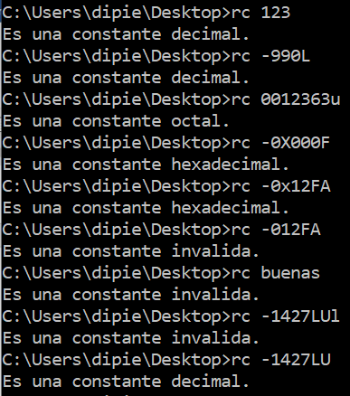
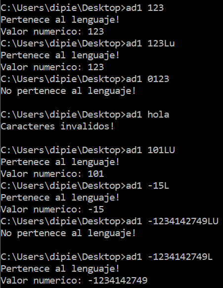
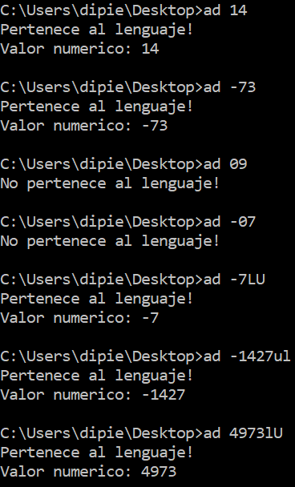
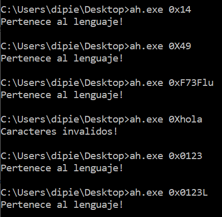
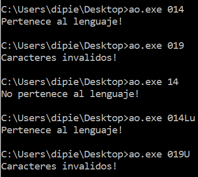
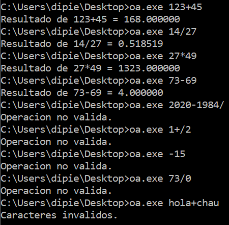

# tpAutomatas
TP de Autómatas (constantes en C)

https://docs.google.com/document/d/1-LdLnhGwV0t-NeAndUfQNu9Fb4wtoYniQtyBoMiCMUQ/edit?usp=sharing

# HECHOS:

## Reconoce constantes:
- reconocedorConstantes/reconocedorConstantes.c  
  Reconoce y clasifica constantes decimales / hexa / octales con o sin signo.
      
  *Nota:* la librería creada por nosotros utilizada en este programa con las columnas / verificadores / autómatas de los programas a continuación:

#### Decimal: (ante la duda, hicimos dos variantes de decimal):
- automataDecimalConSufijov1.c  
  Reconoce constantes decimales, NO aceptando sufijos "u,U" si comienza con "-".
      
- automataDecimalConSufijov2.c  
  Reconoce constantes decimales, SÍ aceptando sufijos "u,U" si comienza con "-".
      
Ambos guardan el valor decimal de la constante ingresada y la muestran en pantalla, en caso de ser válida.

#### Hexa:
- automataHexa.c  
  Reconoce constantes hexadecimales con o sin signo.
- automataHexaConSufijo.c  
  Reconoce constantes hexadecimales con sufijo (p.ej. 0xFFFLu) y con o sin signo.
      

#### Octal:
- automataOctal.c  
  Reconoce constantes octales con o sin signo.
- automataOctalConSufijo.c  
  Reconoce constantes octales con sufijo (p.ej. 0346Ul) con o sin signo.
      
  
## Otros programas:
  
### Operación aritmética:
- operacionesAritmeticas.c  
  Reconoce una expresión aritmética simple (\[num]\[operador]\[num]) y retorna su resultado si es válida.
      
  
### Sufijos (extra):
- automataSufijo.c  
  Reconoce solamente los sufijos: ul, uL, Ul, UL, lu, lU, Lu, LU, l, L, u, U.  
